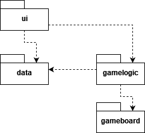
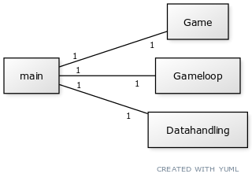

# Arkkitehtuurikuvaus

## Rakenne

Koodin pakkausrakenne on seuraava:

Pakkaus *ui* sisältää käyttöliittymän rakennuksesta vastaavat luokat. Pakkaus *gameboard*
sisältää graafisen pelin muodostumisesta vastaavat luokat ja pakkaus *gamelogic*
varsinaisista pelin loogisista toiminnallisuuksista vastaavat luokat. Pakkaus *data* 
sisältää tietojen tallennukseen, hakemiseen ja näyttämiseen liittuvät luokat.

## Käyttöliittymä

Käyttöliittymä sisältää kolme erillistä näkymää:
    * Aloitusnäkymä
    * Pelatun pelin tulokset
    * Top 10 -lista

Lisäksi varsinainen peli avautuu omaan ikkunaansa.

Jokainen käyttöliittymän näkymä on toteutettu omana luokkanaan. Näkymistä näkyy vain yksi kerrallaan,
ja niitä vaihdetaan käyttäjän klikkausten perusteella. Näkymien näyttämisestä huolehtii UI-luokka.
Käyttöliittymä on pyritty eristämään sovelluslogiikasta, eli se ainoastaan kutsuu sovelluslogiikasta
vastaavien luokkien olioita.

## Sovelluslogiikka

Game-luokka vastaa pelin säännöistä, kuten pelilaudan pohjan luomisesta, siirtojen tekemisestä, uuden laatan
arpomisesta ja pelin päättymisen tunnistamisesta. DataHandling-luokka vastaa pelin tulosten tallentamisesta
ja näyttämisestä.

GameMotor-luokka vastaa peliin tarvittavien olioiden luonnista. Game- ja DataHandling-olioiden lisäksi se luo esimerkiksi pygamen tarvitsemat tapahtumankäsittelijä- ja piirtäjäoliot. GameLoop-luokka vastaa näiden avulla yhden pelikierroksen toiminnasta.

## Tietojen tallennus

Pakkauksen *data* luokka DataHandling huolehtii tietojen tallennuksesta Google Sheets -tiedostoon
pygsheets-kirjaston avulla.

Sovellus tallentaa pelin tiedot yhteen Google Sheets -dokumenttiin ja myös hakee ne sieltä
tietojen näyttämistä varten

Google Docs -dokumentin autentikointiin tarvittavat tiedot on tässä projektissa tallennettu
julkisesti repositorioon. Tämä ei ole tietoturvan kannalta järkevä malli, mutta riskit on
katsottu tämän projektin kannalta riittävän pieneksi.

## Ohjelman rakenteeseen jääneet heikkoudet

Graafisen käyttöliittymän koodissa on toisteisuutta, josta voisi paremmalla suunnittelulla päästä
eroon. Mm. pylint huomauttaa tästä tarkastuksessaan.