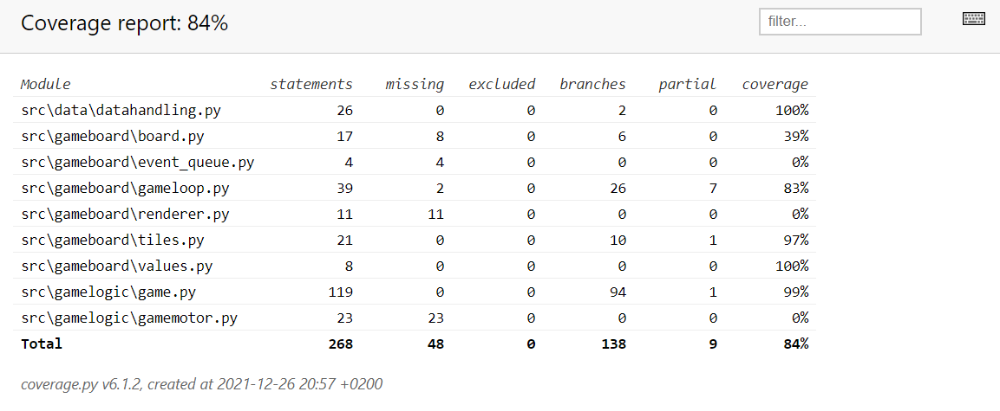

# Testausdokumentti

Ohjelmaa on testattu sekä yksikkö- ja integraatiotasolla että järjestelmätasolla.
Yksikkö- ja integraatiotestaus on suoritettu unittestilla automatisoiduilla testeillä.
Järjestelmätason testit on suoritettu manuaalisesti.

## Yksikkö- ja integraatiotestaus

### Sovelluslogiikka

Varsinaisesta sovelluslogiikasta vastaavaa `Game`-luokkaa testataan TestGame-luokalla. Datan käsittelystä
vastaavaa `DataHandling`-luokkaa testataan TestDataHandling-luokalla. Tietojen käsittelyn testausta varten
testidata tallennetaan eri välilehdelle kuin varsinainen data.

Pelikierroksen pyörittämisestä vastaavaa `GameLoop`-luokkaa testataan TestGameLoop-luokalla. Normaalien
Renderer- ja EventQueue-luokkien sijasta testiluokalle annetaan erilliset StubRenderer- ja StubEventQueue-oliot.

### Testauskattavuus

Käyttöliittymäkerros on jätetty testauskattavuuden ulkopuolelle. Tällöin sovelluksen testauksen haaraumakattavuus
on 84 %.

Pääsääntöisesti testikattavuuden ulkopuolella on erilaisia pelilaudan piirtämiseen liittyviä toimintoja, eli erilaisia
pygamen metodeja.

## Järjestelmätestaus

Järjestelmätestaus on suoritettu manuaalisesti. Sovellus on haettu ja sitä on testattu [käyttöohjeen](kayttoohje.md) mukaisesti.
Sovellusta on testattu Windows 10-ympäristössä ja virtuaalityöpöydän kautta Linux-ympäristössä. Kaikki 
[määrittelydokumentissa](maarittelydokumentti.md) ja [käyttöohjeessa](kayttoohje.md) listatut toiminnallisuudet on
käyty läpi.

## Sovellukseen jääneet laatuongelmat